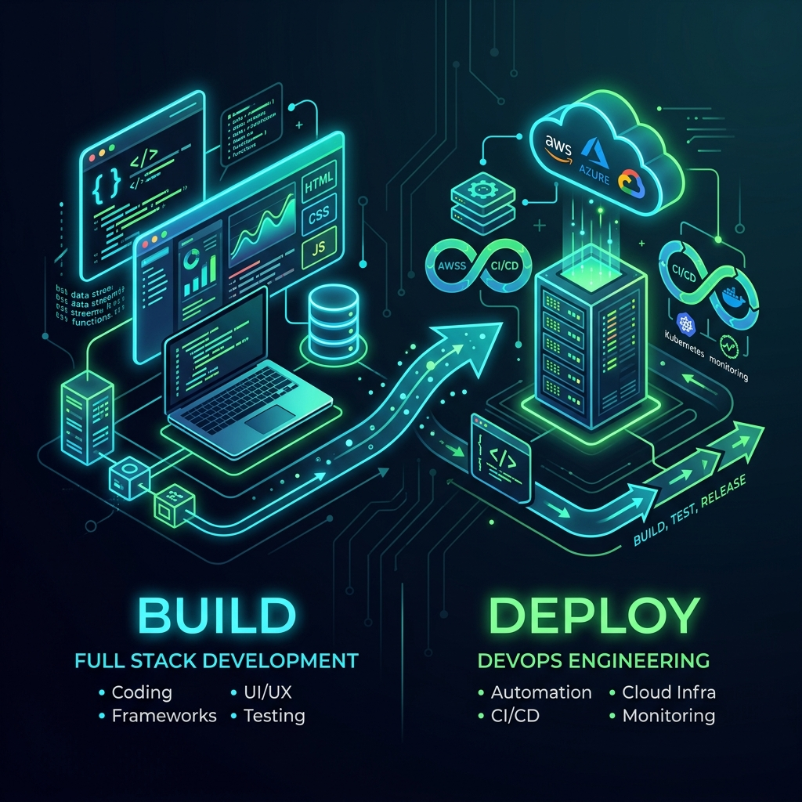

# Hi 👋, I'm Sanjana

  <b>A passionate Full Stack Developer & DevOps Engineer 🚀</b>

  

  

  

---

### ⚡ The "Build & Deploy" Catalyst

I bridge the gap between **high-performance application development** and **bulletproof cloud infrastructure**. I don't just write code—I design it to be containerized, automated, autoscaled, and highly resilient in production.

- 🏗️ **Currently:** Designing high-performance web applications and automating cloud platforms.
- 💻 **Core focus:** Bridging the gap between clean frontend/backend code and robust production infrastructure.
- ⚙️ **Ask me about:** React, Next.js, Django, AWS EKS, Docker, & Terraform.
- 📂 **Featured Work:** All my major projects are highlighted in my pinned repositories right below!
- 📧 **How to reach me:** <a href="mailto:sanjanamaahi2001@gmail.com"><b>sanjanamaahi2001@gmail.com</b></a>
- ⚡ **Fun fact:** I write code that builds code that deploys code. *Inception-style!* ☕

---

### Connect with me:

  
  
  

---

### Languages and Tools:

  <!-- Python -->
  
  <!-- JavaScript -->
  
  <!-- TypeScript -->
  
  <!-- Go -->
  
  <!-- Bash -->
  
  <!-- React -->
  
  <!-- Next.js -->
  
  <!-- Django -->
  
  <!-- FastAPI -->
  
  <!-- AWS -->
  
  <!-- Azure -->
  
  <!-- EKS -->
  
  <!-- Kubernetes -->
  
  <!-- Docker -->
  
  <!-- Terraform -->
  
  <!-- CloudFormation -->
  
  <!-- Helm -->
  
  <!-- Ansible -->
  
  <!-- GitHub Actions -->
  
  <!-- Jenkins -->
  
  <!-- CircleCI -->
  
  <!-- Bitbucket -->
  
  <!-- GitHub -->
  
  <!-- PostgreSQL -->
  
  <!-- MongoDB -->
  

---

### GitHub Analytics:

  
  

  

